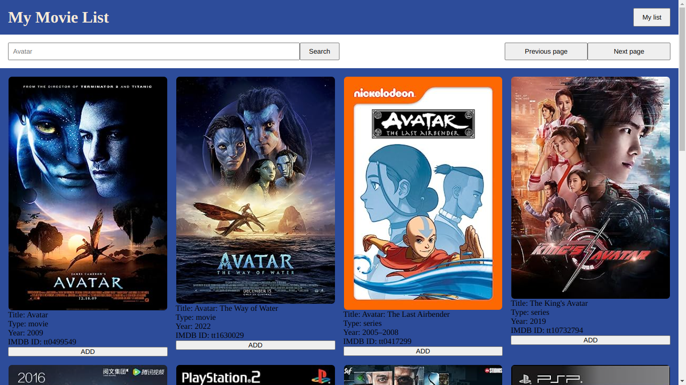

# My Movie List
- Movie data searcher made with OMDB API



## Features
- Search for your favorite movies in Open Movie Data Base
- (In progress) Favorite them and make your own list

## Run in your machine
- Clone the repository in your machine:
```bash
git clone 
```

- Go to /my-movie-list, you will need Vitejs, so type:
```bash
npm install
```

- You will need an OMDB API KEY:
    - You can acquire one in <a href="https://omdbapi.com/" target="_blank">OMDB</a> 
    - After registering, your key will comes to your mail
    - Create a .env file in the root folder and create an API_KEY with your OMDB API KEY following a single rule:
    - Your key needs to start with a reserved word called "VITE_" + whatever you wants, let me show you an example:
    <br/>
    VITE_OMDB_API_KEY = 'myOMDBMailKey'

- Run:
```bash
npm run dev
```

- Enjoy!